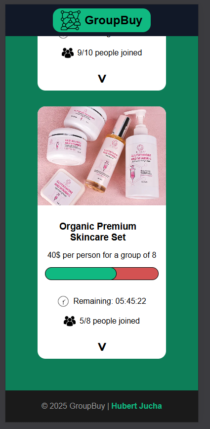

# 🛒 GroupBuy Platform

Full-stack platform for group buying - portfolio project for internship.

**Status:** ✅ Week 1 Complete | 🚧 Week 2 Starting

---

## 🎯 About

Platform for organizing group purchases to get better prices. The more people join a campaign, the lower the price per person.

**Key Concept:** Price tiers based on participant count
- 1-4 people: 50 PLN/person
- 5-9 people: 40 PLN/person
- 10+ people: 30 PLN/person

---

## 🚀 Tech Stack

**Frontend:**
- React, TypeScript
- Material-UI (MUI), Tailwind CSS
- RxJS (WebSocket management)

**Backend:**
- Java, Spring Boot
- PostgreSQL + JPA/Hibernate
- JWT Authentication
- REST API

**DevOps:**
- Docker, Docker Compose

**Real-time:**
- WebSockets (live participant updates)
- Spring Scheduler (automatic campaign closure)

---

## 📋 Features (Planned)

- ✅ Group buying campaigns with price tiers
- ✅ Real-time participant updates (WebSocket)
- ✅ JWT authentication & protected routes
- ✅ Campaign management dashboard
- ✅ Automatic campaign closure (scheduled tasks)
- ✅ Responsive design (mobile-first)

---

## 📐 Project Structure

```
/docs
  - progress.md       # Weekly progress tracker
  - tech-stack.md     # Technology overview
  - wireframes/       # UI mockups (Figma exports)
```

---

## 📖 Documentation

- [📊 Progress Tracker](docs/progress.md) - Weekly milestones
- [🛠️ Tech Stack](docs/tech-stack.md) - Technology deep dive
- [🎨 Wireframes](docs/wireframes/) - UI mockups (5 screens)

---

## 🗓️ Timeline

- **Start:** November 7, 2025
- **Target:** March/April 2026 (~5 months)
- **Current Phase:** Week 1 - HTML/CSS Basics

**Progress:**
- ✅ Week 0: Setup & Wireframes (Nov 7-8)
- ✅ Week 1: HTML/CSS Landing Page (Nov 9-15)
- 🚧 Week 2: JavaScript Basics (Nov 16-22)
- ⏳ Week 3-4: Interactive Features
- ⏳ Week 5-6: React + TypeScript
- ⏳ Week 7-12: Spring Boot Backend
- ⏳ Week 13-16: Integration & Real-time
- ⏳ Week 17-20: Testing & Deployment

---

## 👤 Author

**pxyvrld** (Hubert Jucha)  
Computer Science Student  
Portfolio project | 2025  
Target: Full-stack Java Developer internship

---

## 📸 Screenshots

### Week 1: Landing Page (HTML/CSS)

**Desktop:**


**Mobile:**




---

## 📝 License

MIT License - Educational project, feel free to learn from it.

---

_Last updated: November 15, 2025, 01:11 UTC_