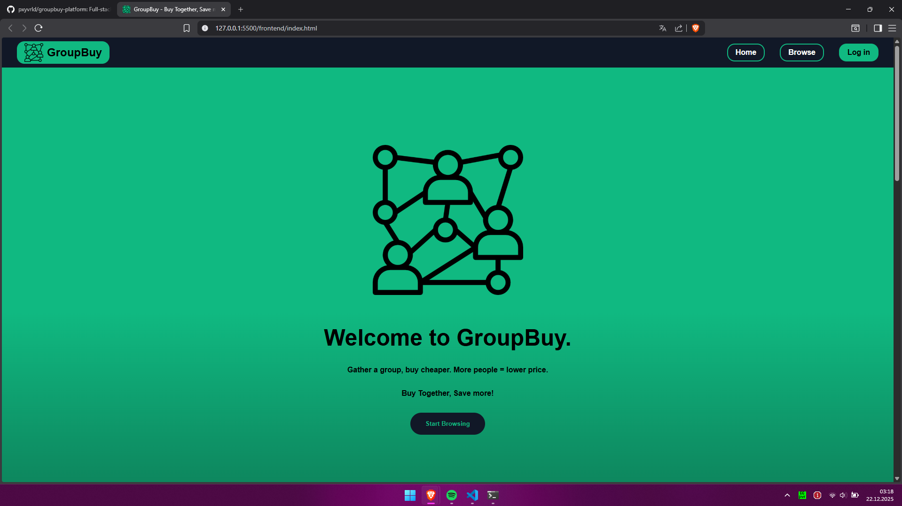
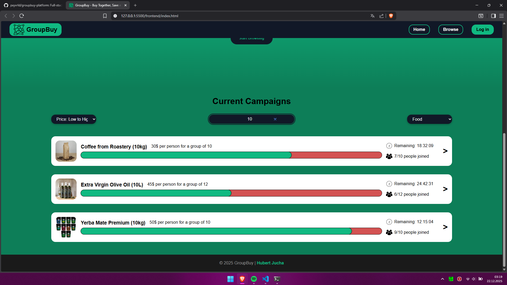
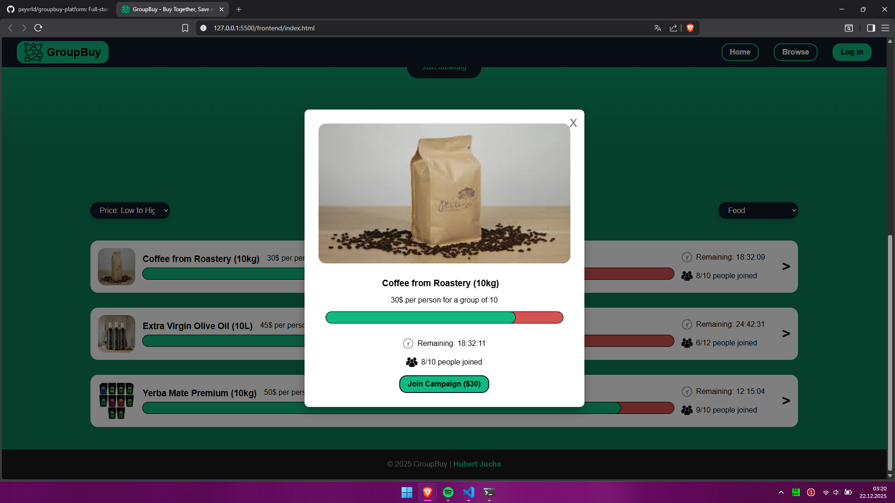
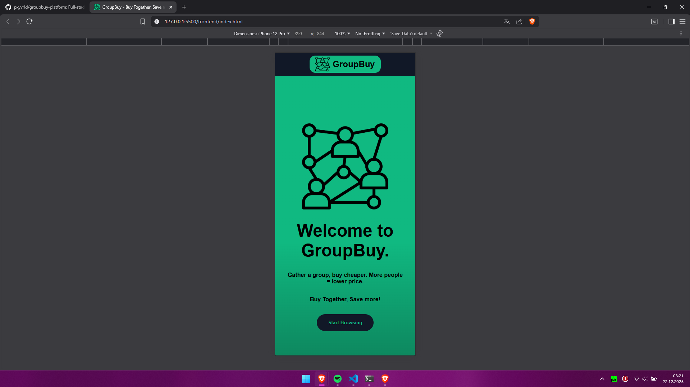
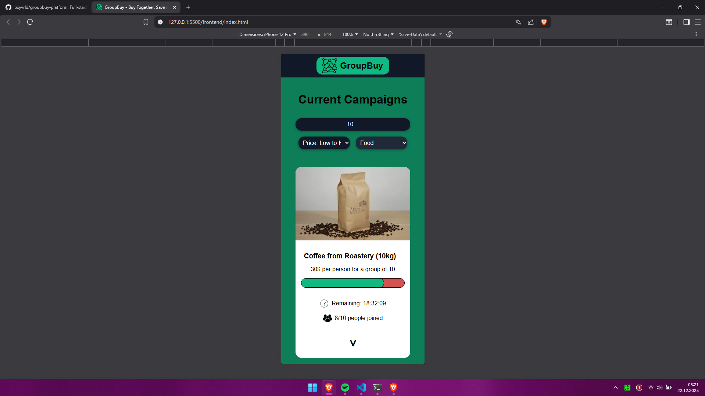
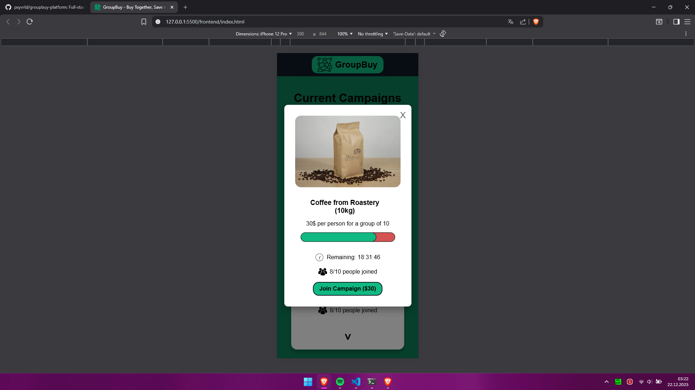

# 🛒 GroupBuy Platform

> Full-stack crowdfunding platform for group purchases - portfolio project demonstrating progressive skill development from vanilla JavaScript to React + Spring Boot. 

**Current Status:** ✅ Week 3 Complete - React Migration + UI Improvements | 🚧 Week 4 Starting - React Router + Pages

**Last updated:** January 4, 2026

---

## 🎯 About

Platform for organizing group purchases to get better prices through collective buying power. 

**Core Concept:** Dynamic price tiers based on participant count
- Example: Coffee beans (10kg)
  - 1-4 people: 50 PLN/person
  - 5-9 people: 40 PLN/person
  - 10+ people: 30 PLN/person

**Purpose:** Portfolio project showcasing progressive skill building - each week introduces new technologies (vanilla JS → React → Spring Boot → Docker).

---

## ✨ Features (Current - Week 3: React)

### React Core
- ✅ Component-based architecture (Header, Hero, Filters, CampaignCard, Footer, HowItWorks)
- ✅ State management with `useState` (search, filters, sort, countdown timers)
- ✅ Side effects with `useEffect` (per-card countdown timers with cleanup)
- ✅ Props drilling and lifting state up
- ✅ Controlled form inputs

### Campaign Management
- ✅ Dynamic rendering of 12 campaigns with React components
- ✅ Campaign cards with animated progress bars
- ✅ Live countdown timers (updates every second, cleanup on unmount)

### Filtering & Search
- ✅ Category filter (Food, Beauty, Electronics, Sports, All)
- ✅ Real-time search by campaign title
- ✅ Multi-option sorting (price, people joined, deadline)
- ✅ Combined filters work seamlessly

### UI/UX Improvements (Week 3)
- ✅ Responsive hamburger menu with slide-in animation
- ✅ "How It Works" section (3-step guide)
- ✅ Improved card badges (auto-sizing, no text wrapping)
- ✅ Grid layout (2 cols desktop, 1 col mobile)
- ✅ Smooth scroll navigation
- ✅ Card hover effects
- ✅ Fixed Hero height on mobile (calc(100vh - 4rem))

---

## 🛠️ Tech Stack

### Current (Week 1-3)
- **Frontend**:  React, JavaScript (ES6+), HTML5, CSS3
- **Build Tool**: Vite
- **State Management**: React Hooks (useState, useEffect)
- **Layout**: Flexbox, CSS Grid
- **Styling**: CSS Modules, CSS Variables
- **Data**: Local mock data (campaigns. js)
- **Animations**: CSS transitions, keyframe animations

### Planned (Week 3+)
- **Frontend**: React, TypeScript, Vite
- **UI Libraries**: Material-UI (MUI), Tailwind CSS
- **State Management**: React Hooks, Context API
- **Routing**: React Router
- **Real-time**: WebSockets, RxJS
- **Backend**: Java, Spring Boot, PostgreSQL
- **Auth**: JWT, Spring Security
- **DevOps**: Docker, Docker Compose
- **Testing**: JUnit, Mockito (backend), Jest (frontend)

---

## 📅 Project Timeline

| Week | Focus | Status | Branch | Hours |
|------|-------|--------|--------|-------|
| **Week 0** | Setup & Wireframes | ✅ Done | - | ~5h |
| **Week 1** | HTML/CSS Landing Page | ✅ Done | `week1/landing-page` | ~8h |
| **Week 2** | JavaScript Functionality | ✅ Done | `week2/javascript-basics` | ~12-15h |
| **Week 3** | React Migration + UI | ✅ Done | `week3/react-migration` | ~15-20h |
| **Week 4+** | Spring Boot Backend | ⏳ Planned | - | TBD |

**Total time invested:** ~25-28 hours

**Start date:** November 7, 2025  
**Target completion:** March/April 2026 (~5 months)

---

## 🌿 Branches

This project uses **branch-per-week strategy** to showcase progressive development:

- **`main`** - Current stable version (merged weekly progress)
- **`week1/landing-page`** - Pure HTML/CSS landing page (no JavaScript)
- **`week2/javascript-basics`** - Vanilla JS implementation ✅ **CURRENT**
  - Features: filters, search, sorting, modals, API calls, localStorage
- **`week3/react-migration`** - React refactor (coming soon)
- *(more branches added as project progresses)*

**For recruiters:** Check individual branches to see skill evolution from vanilla JavaScript through React to Spring Boot.

---

## 🚀 How to Run (Current Version)

```bash
# Clone repository
git clone https://github.com/pxyvrld/groupbuy-platform.git

# Navigate to project
cd groupbuy-platform

# Live Server (VS Code extension - recommended)
# Right-click frontend/index.html → "Open with Live Server"
```

**Requirements:** Modern browser (Chrome, Firefox, Safari, Edge)

---

## 📂 Project Structure

```
groupbuy-platform/
├── frontend/
│   ├── index.html          # Main HTML file
│   ├── css/
│   │   └── styles.css      # All styles (~600 lines)
│   ├── js/
│   │   └── script.js       # Vanilla JS logic (~400 lines)
│   ├── campaigns. json      # Mock campaign data (12 campaigns)
│   └── assets/
│       ├── images/         # Campaign images, logo
│       └── icons/          # Favicon
├── docs/
│   ├── progress.md         # Weekly progress tracker
│   ├── tech-stack.md       # Technology deep dive
│   ├── wireframes/         # Figma mockups (5 screens)
│   └── screenshots/        # Week 1 & 2 screenshots
├── README.md               # This file
├── LICENSE                 # MIT License
└── . gitignore
```

---

## 🎓 Learning Goals

This project demonstrates progressive skill development for full-stack web development. 

### Week 2 (Completed) - JavaScript Fundamentals: 
- ✅ ES6+ syntax (arrow functions, destructuring, template literals)
- ✅ DOM manipulation (querySelector, addEventListener, innerHTML)
- ✅ Async programming (Promises, async/await, try/catch)
- ✅ Fetch API (HTTP requests, response handling, JSON parsing)
- ✅ LocalStorage API (data persistence across sessions)
- ✅ Event handling (click, input, change, event delegation)
- ✅ Array methods (filter, map, sort, find)
- ✅ Error handling (network errors vs HTTP status codes)
- ✅ Timers (setInterval, clearInterval, cleanup)

### Week 3 (Planned) - React:
- 🔜 Component architecture & composition
- 🔜 React Hooks (useState, useEffect, custom hooks)
- 🔜 Props & state management
- 🔜 React Router (client-side routing)
- 🔜 TypeScript integration

### Week 4+ (Planned) - Backend:
- 🔜 Spring Boot (REST API, controllers, services)
- 🔜 PostgreSQL + JPA/Hibernate
- 🔜 JWT authentication & Spring Security
- 🔜 Repository/Service/Controller architecture
- 🔜 Docker containerization

---

## 📸 Screenshots

### Week 1: Landing Page (HTML/CSS)

**Desktop:**

<table>
  <tr>
    <td></td>
    <td></td>
  </tr>
</table>

**Mobile:**

<table>
  <tr>
    <td></td>
    <td></td>
  </tr>
</table>

### Week 2: Interactive Features (JavaScript)

**Desktop:**

<table>
  <tr>
    <td></td>
    <td></td>
    <td></td>
  </tr>
</table>

**Mobile:**

<table>
  <tr>
    <td></td>
    <td></td>
    <td></td>
  </tr>
</table>

---

## 📝 Notes for Recruiters

This is a **learning project** showcasing progressive skill development: 

**1. Branch-per-week structure** - Each branch represents a milestone: 
   - `week1/landing-page` → Pure HTML/CSS (structure, layout, responsiveness)
   - `week2/javascript-basics` → Vanilla JS (DOM, async, API calls)
   - `week3/react-migration` → React refactor (components, hooks)
   - Week 4+ → Spring Boot backend

**2. Real-world patterns** - Even in vanilla JS: 
   - Separation of concerns (filter/render/update functions)
   - Error handling (try/catch, loading/error states)
   - Data persistence (localStorage)
   - Async programming (fetch, await, JSON parsing)

**3. Professional practices:**
   - Git workflow (feature branches, descriptive commits)
   - Documentation (README, progress tracker, code comments)
   - Accessibility (semantic HTML, ARIA labels)
   - Responsive design (mobile-first approach, flexbox)

**4. Problem-solving approach:**
   - No tutorials copied - each feature built from scratch with mentor guidance
   - Debugging skills (console logs, DevTools, error analysis)
   - Refactoring (DRY principles, reusable functions)
   - Testing (manual QA, edge case handling)

**Time invested:** ~25-29 hours (Weeks 0-2)  
**Target role:** Full-Stack Developer (Spring Boot + React)

---

## 👤 Author

**pxyvrld** (Hubert Jucha)  
Computer Science Student  
📧 [hubertjucha21@gmail.com]  
🔗 [LinkedIn](https://www.linkedin.com/in/hubert-jucha/)  
🐙 [GitHub](https://github.com/pxyvrld)

💼 Seeking:  Full-Stack Developer Internship

---

## 📄 License

MIT License - Educational/portfolio project, free to learn from.

See [LICENSE](LICENSE) file for details.

---

_Last updated: December 22, 2025, 03:27 UTC_