# 🛒 GroupBuy Platform

> Full-stack crowdfunding platform for group purchases - portfolio project demonstrating progressive skill development from vanilla JavaScript to TypeScript + React + Spring Boot.

**Current Status:** ✅ Week 5 Complete — Spring Boot REST API (in-memory) | 🔜 Week 6 — PostgreSQL + JPA + Flyway

**Last updated:** March 19, 2026

---

## 🎯 About

Platform for organizing group purchases to get better prices through collective buying power.

**Core Concept:** Dynamic price tiers based on participant count
- Example: Coffee beans (10kg)
  - 1-4 people: 50 PLN/person
  - 5-9 people: 40 PLN/person
  - 10+ people: 30 PLN/person

**Purpose:** Portfolio project showcasing progressive skill building - each week introduces new technologies (vanilla JS → React → TypeScript → Spring Boot → Docker).

---

## ✨ Features

### Frontend (Week 4: React + TypeScript + React Router)
- ✅ Multi-page app with routes:
  - `/`, `/campaigns`, `/campaign/:id`, `/login`, `/signup`, `/dashboard`, `/create`, `*` (404)
- ✅ TypeScript migration (`.jsx` → `.tsx`), typed props/hooks
- ✅ Filtering/search/sorting, responsive UI, hamburger menu
- ✅ Mock auth using `localStorage` (temporary, will be replaced by backend auth)

### Backend (Week 5: Spring Boot REST API — in-memory)
- ✅ Campaign endpoints:
  - `GET /api/campaigns`
  - `GET /api/campaigns/{id}` (`200` / `404`)
  - `POST /api/campaigns` (`201 Created` + `Location` header)
  - `DELETE /api/campaigns/{id}` (`204` / `404`)
- ✅ Request validation (`@Valid`) with consistent error response:
  - `{ "errors": { "field": "message" } }`
- ✅ Manual testing in Postman (201/204/400/404 cases)

---

## 🛠️ Tech Stack

### Current (Week 1-4)
- **Frontend**: React, TypeScript, JavaScript (ES6+), HTML5, CSS3
- **Build Tool**: Vite
- **Routing**: React Router v6
- **State Management**: React Hooks (useState, useEffect)
- **Layout**: Flexbox, CSS Grid
- **Styling**: CSS Modules, CSS Variables
- **Data**: Local mock data (campaigns.ts, mockUser)
- **Animations**: CSS transitions, keyframe animations
- **Type Safety**: TypeScript (strict mode)

### Planned (Week 5-6)
- **Backend**: Java, Spring Boot, PostgreSQL
- **Auth**: JWT, Spring Security
- **API**: REST API (CRUD for campaigns + users)
- **ORM**: JPA/Hibernate
- **DevOps**: Docker, Docker Compose
- **Testing**: JUnit, Mockito (backend), Jest (frontend)
- **Advanced React**: Context API, Protected Routes, Custom Hooks

---

## 📅 Project Timeline

| Week | Focus | Status | Branch | Hours |
|------|-------|--------|--------|-------|
| **Week 0** | Setup & Wireframes | ✅ Done | - | ~5h |
| **Week 1** | HTML/CSS Landing Page | ✅ Done | `week1/landing-page` | ~8h |
| **Week 2** | JavaScript Functionality | ✅ Done | `week2/javascript-basics` | ~12-15h |
| **Week 3** | React Migration + UI | ✅ Done | `week3/react-migration` | ~15-20h |
| **Week 4** | TypeScript + React Router | ✅ Done | `week4/advanced-react` | ~18-22h |
| **Week 5** | Spring Boot Backend REST API (in-memory) | ✅ Done | `week5/backend-setup` | TBD |
| **Week 6** | Persistence: PostgreSQL + JPA + Flyway | 🚧 Next | `week6/persistence-postgres-jpa` | TBD |

**Total time invested:** ~58-70 hours (Week 0-4)

**Start date:** November 7, 2025  
**Target completion:** March/April 2026 (~5 months)

---

## 🌿 Branches

This project uses **branch-per-week strategy** to showcase progressive development:

- **`main`** - Current stable version (merged weekly progress)
- **`week1/landing-page`** - Pure HTML/CSS landing page (no JavaScript)
- **`week2/javascript-basics`** - Vanilla JS implementation (filters, search, sorting, modals, API calls, localStorage)
- **`week3/react-migration`** - React refactor (components, hooks, UI improvements)
- **`week4/advanced-react`** — TypeScript + React Router (frontend milestone) ✅
- **`week5/backend-setup`** — Spring Boot REST API basics (CRUD + validation + error handling) ✅
- **`week6/persistence-postgres-jpa`** — PostgreSQL + JPA + Flyway migrations (coming next)

**For recruiters:** Check individual branches to see skill evolution from vanilla JavaScript through React/TypeScript to Spring Boot.

---

## 🚀 How to Run

### 1) Start database (Docker)
From repo root: `docker compose up -d`

> Note: at the moment the backend still uses **in-memory storage** for campaigns (Week 5).  
> PostgreSQL persistence will be implemented in **Week 6**.

### 2) Run backend (Spring Boot)
From repo root:

- With Maven Wrapper: `cd backend && ./mvnw spring-boot:run`
- Without wrapper: `cd backend && mvn spring-boot:run`

Backend typically runs on: `http://localhost:8080`

### 3) Run frontend (Vite)
From repo root: `cd frontend && npm install && npm run dev`

Frontend typically runs on: `http://localhost:5173`

---

## 🔌 API (Week 5)

### Create campaign
`POST /api/campaigns`

Example body:
`{ "title": "Tea", "status": "OPEN" }`

Expected:
- `201 Created`
- `Location: /api/campaigns/{id}`
- response body with created campaign DTO

### Validation error format
Example response (`400 Bad Request`):
`{ "errors": { "title": "must not be blank", "status": "must not be blank" } }`

---

## 📂 Project Structure (high-level)
- `backend/` — Spring Boot backend
- `frontend/` — React + TypeScript frontend (Vite)
- `docs/` — progress tracker, tech notes, screenshots
- `README.md`
- `LICENSE`

---

## 🎓 Learning Goals

This project demonstrates progressive skill development for full-stack web development.

### Week 4 (Completed) - TypeScript + React Router:
- ✅ TypeScript fundamentals (types, interfaces, generics)
- ✅ Type-safe React components (props interfaces, typed hooks)
- ✅ React Router v6 (BrowserRouter, Routes, Route, Link)
- ✅ Dynamic routing (useParams, useNavigate)
- ✅ Page-based architecture (separation of pages vs components)
- ✅ Form handling in TypeScript (event types, controlled inputs)
- ✅ Type definitions for complex data structures
- ✅ Compile-time error catching

### Week 3 (Completed) - React Fundamentals:
- ✅ Component architecture & composition
- ✅ React Hooks (useState, useEffect, cleanup functions)
- ✅ Props & state management (lifting state up, props drilling)
- ✅ Conditional rendering & list rendering
- ✅ Event handling in React
- ✅ CSS Modules & CSS Variables

### Week 2 (Completed) - JavaScript Fundamentals:
- ✅ ES6+ syntax (arrow functions, destructuring, template literals)
- ✅ DOM manipulation (querySelector, addEventListener, innerHTML)
- ✅ Async programming (Promises, async/await, try/catch)
- ✅ Fetch API (HTTP requests, response handling, JSON parsing)
- ✅ LocalStorage API (data persistence)
- ✅ Array methods (filter, map, sort, find, reduce)
- ✅ Error handling (network errors vs HTTP status codes)
- ✅ Timers (setInterval, clearInterval, cleanup)

### Week 5-6 (Planned) - Backend:
- 🔜 Spring Boot (REST API, controllers, services, repositories)
- 🔜 PostgreSQL + JPA/Hibernate (ORM, entities, relationships)
- 🔜 JWT authentication & Spring Security
- 🔜 CORS configuration
- 🔜 DTO pattern & validation
- 🔜 Docker containerization (Dockerfile, docker-compose)
- 🔜 Frontend-backend integration (Axios, AuthContext, Protected Routes)

---

## 📸 Screenshots

### Week 4: TypeScript + React Router

**Desktop Views:**

<table>
  <tr>
    <td></td>
    <td>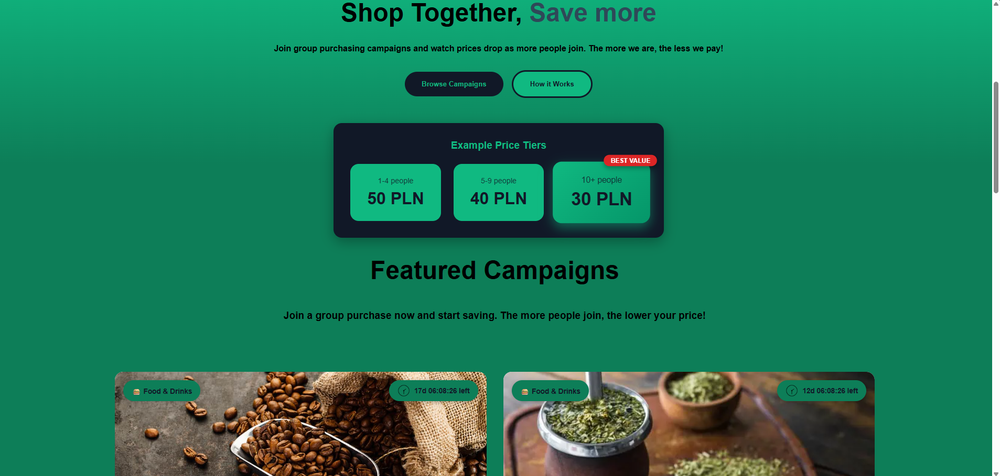</td>
  </tr>
  <tr>
    <td></td>
    <td></td>
  </tr>
  <tr>
    <td></td>
    <td>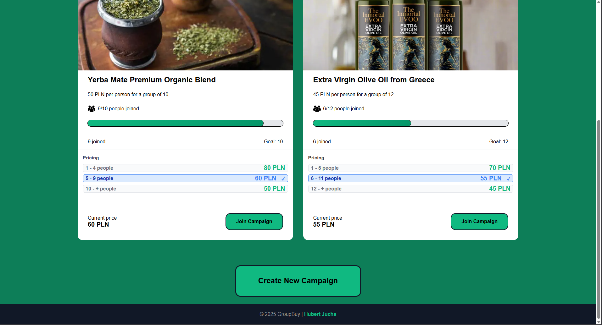</td>
  </tr>
  <tr>
    <td></td>
    <td></td>
  </tr>
  <tr>
    <td>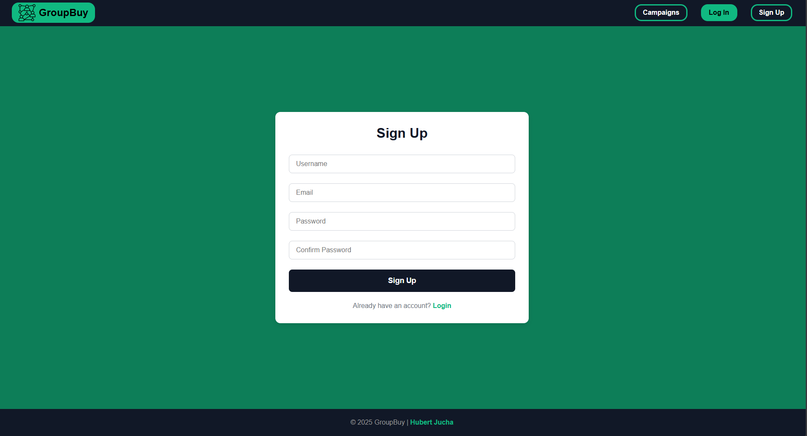</td>
    <td>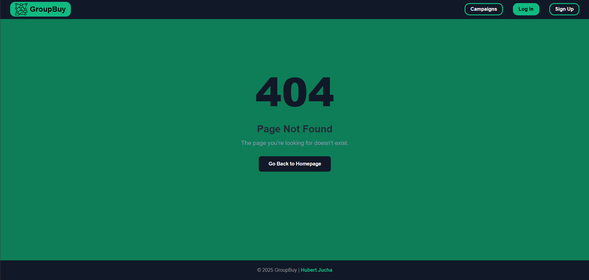</td>
  </tr>
</table>

**Mobile Views:**

<table>
  <tr>
    <td></td>
    <td>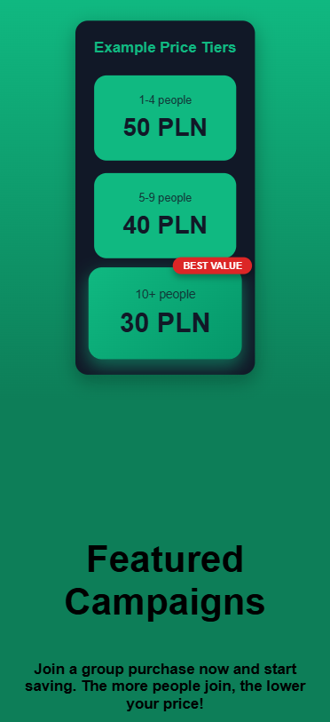</td>
    <td>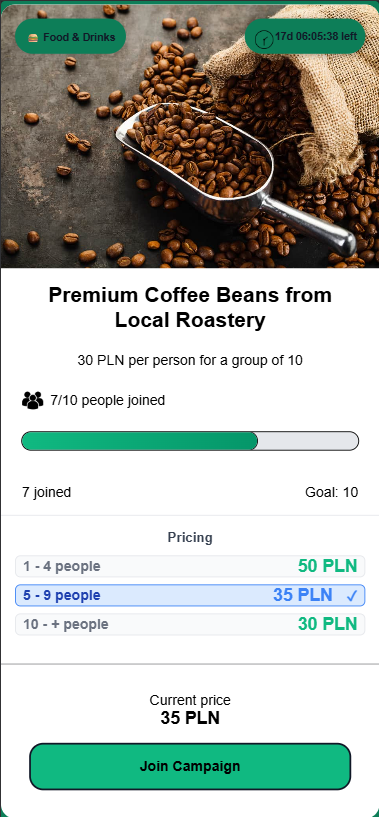</td>
    <td>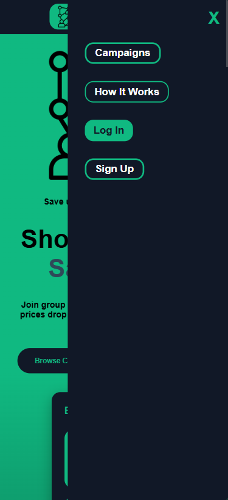</td>
  </tr>
  <tr>
    <td></td>
    <td></td>
    <td>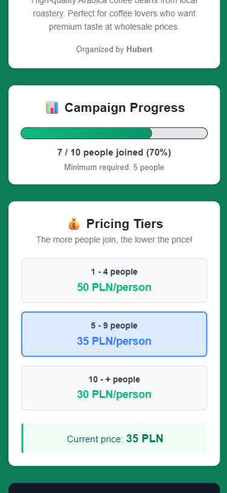</td>
    <td>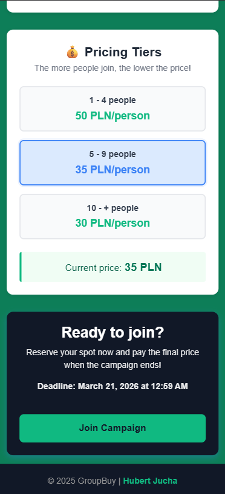</td>
  </tr>
  <tr>
    <td>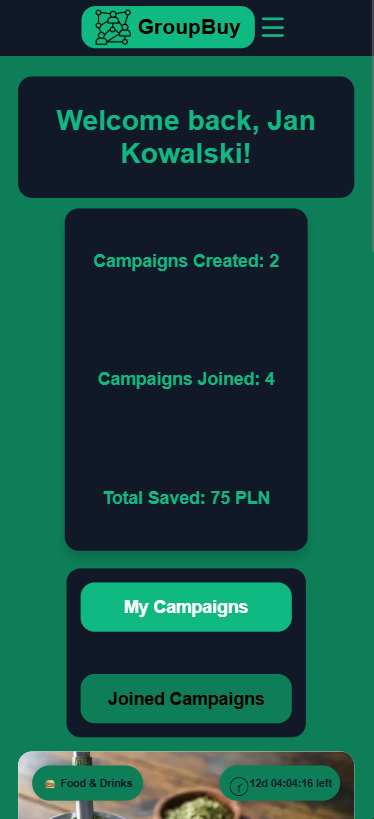</td>
    <td>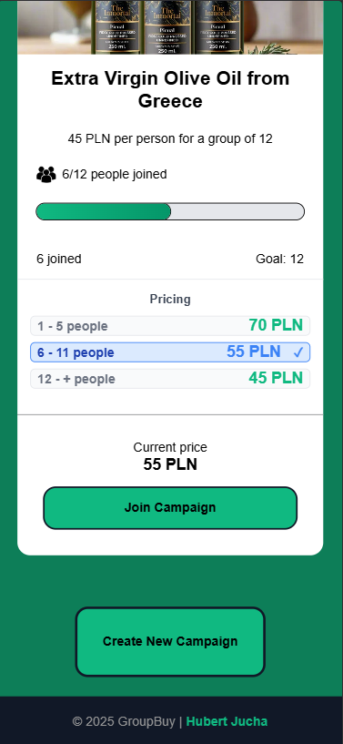</td>
    <td>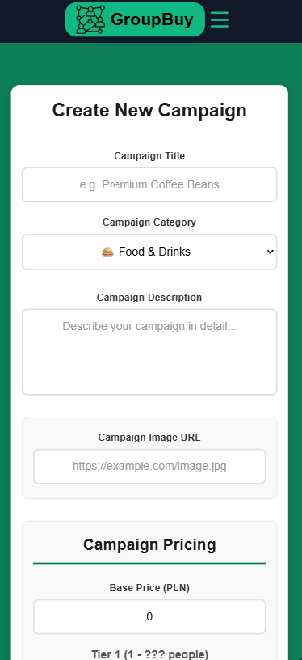</td>
    <td>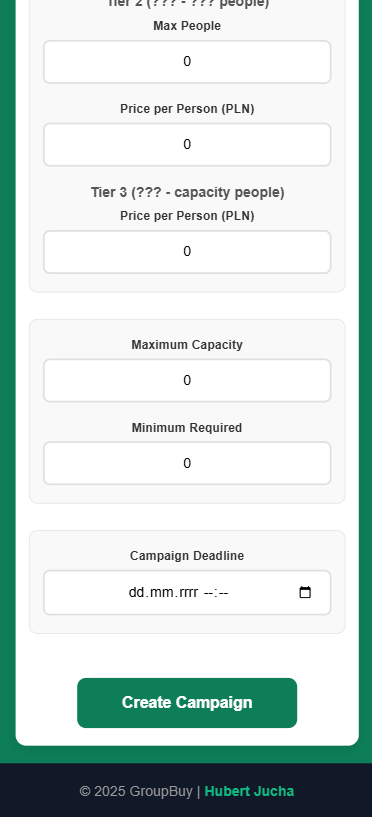</td>
  </tr>
  <tr>
    <td>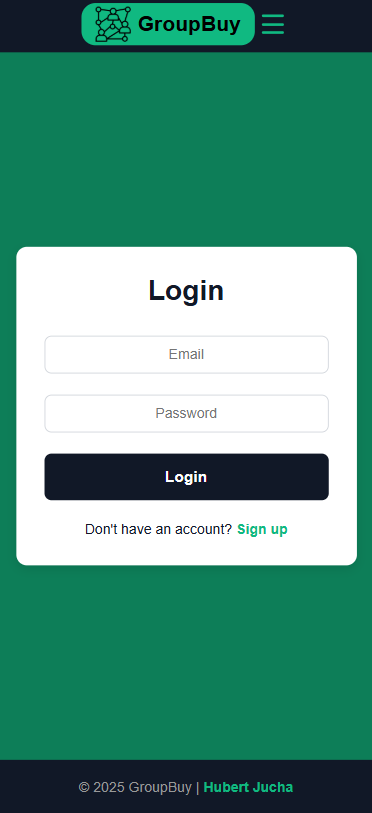</td>
    <td>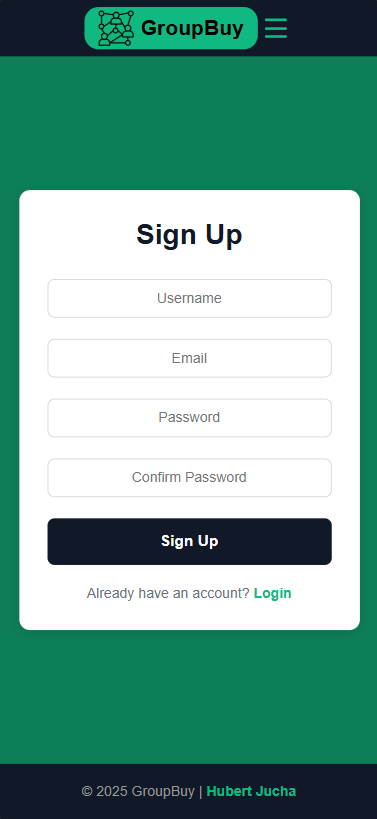</td>
  </tr>
</table>

---

## 📝 Notes for Recruiters

This is a **learning project** showcasing progressive skill development:

**1. Branch-per-week structure** - Each branch represents a milestone:
   - `week1/landing-page` → Pure HTML/CSS (structure, layout, responsiveness)
   - `week2/javascript-basics` → Vanilla JS (DOM, async, API calls)
   - `week3/react-migration` → React refactor (components, hooks)
   - `week4/advanced-react` → TypeScript + React Router (type safety, routing)
   - Week 5-6 → Spring Boot backend + Docker

**2. Real-world patterns**:
   - Repository/Service/Controller architecture (coming in backend)
   - Type-safe development (TypeScript interfaces, compile-time checks)
   - Component reusability (DRY principle)
   - Separation of concerns (pages vs components, data vs UI)
   - Error handling (null checks, 404 pages, form validation)

**3. Professional practices:**
   - Git workflow (feature branches, descriptive commits, PRs)
   - Documentation (README, progress tracker, code comments)
   - Accessibility (semantic HTML, ARIA labels)
   - Responsive design (mobile-first approach, flexbox, grid)
   - Type safety (zero TypeScript errors, strict mode)
   - Code quality (no implicit `any`, proper cleanup in useEffect)

**4. Problem-solving approach:**
   - No tutorials copied - each feature built from scratch with mentor guidance
   - Debugging skills (TypeScript errors, React DevTools, console debugging)
   - Refactoring (vanilla JS → React → TypeScript)
   - Testing (manual QA, edge case handling)

**Time invested:** ~58-70 hours (Weeks 0-4)  
**Target role:** Full-Stack Developer (Spring Boot + React + TypeScript)

---

## 👤 Author

**pxyvrld** (Hubert Jucha)  
Computer Science Student  
📧 [hubertjucha21@gmail.com]  
🔗 [LinkedIn](https://www.linkedin.com/in/hubert-jucha/)  
🐙 [GitHub](https://github.com/pxyvrld)

💼 Seeking:  Full-Stack Developer Internship

---

## 📄 License

MIT License - Educational/portfolio project, free to learn from.

See [LICENSE](LICENSE) file for details.

---

_Last updated: March 19, 2026_