# GroupBuy Platform - Progress Tracker

## 📋 PROJEKT
- **Nazwa:** GroupBuy Platform
- **Opis:** Platforma do wspólnych zakupów
- **Cel:** Portfolio na staż Full-Stack Java Developer

## 🗓️ TIMELINE
- Start: 7 listopada 2025
- Deadline: marzec/kwiecień 2026
- Czas: ~5 miesięcy

## 📅 TYDZIEŃ 0: Setup środowiska (7-8 listopada 2025)

### Cele:
- Setup środowiska (VS Code, Git, Node.js, Copilot)
- Utworzenie repo na GitHub
- Wireframe projektu (4 ekrany)
- Przegląd tech stacku
- Ustalenie palety kolorów

### Zrobione:
- ✅ VS Code zainstalowany
- ✅ Git zainstalowany  
- ✅ Node.js v22.14 (już był)
- ✅ GitHub Copilot aktywowany
- ✅ Repo utworzone: https://github.com/pxyvrld/groupbuy-platform
- ✅ Struktura `docs/` gotowa
- ✅ `.gitignore` zaktualizowany (Node + Java + IDE + OS + Docker)
- ✅ Tech stack dokumentacja (`docs/tech-stack.md`)
- ✅ Wireframes (5 ekranów w Figmie):
  - Landing Page
  - Campaign Details
  - My Campaign Details
  - Create Campaign Form
  - User Dashboard
- ✅ Paleta kolorów ustalona (#10B981 green theme)
- ✅ README.md zaktualizowany

**Status:** ✅ ZAKOŃCZONY (8 listopada 2025, 02:00)

---

## 📅 TYDZIEŃ 1: HTML/CSS Basics (9-15 listopada 2025)

### Cele:
- Landing Page w czystym HTML/CSS
- Navbar, Hero, Campaign Cards, Footer
- Flexbox w praktyce
- Responsywność (desktop-first approach)
- Hover animations

### Zrobione:
- ✅ Struktura HTML Landing Page (semantyczny, accessibility)
- ✅ CSS styling z Flexbox layout
  - Navbar (sticky, z-index: 1000)
  - Hero section (gradient background, logo)
  - Campaign cards (horizontal desktop, vertical mobile)
  - Footer z linkiem do GitHub
- ✅ Responsywność (breakpoint 768px)
  - Desktop: horizontal cards (80% width)
  - Mobile: vertical cards (95% width, full-width images)
- ✅ Hover animations (transition + transform)
  - Karty: `translateY(-8px)` + box-shadow
  - Buttony: color inversion
  - Linki navbar: background-color change
  - Strzałka: `translateX(10px)` (desktop), `rotate(90deg)` (mobile)
- ✅ Progress bary z dynamicznymi wartościami (70%, 90%, 62.5%)
- ✅ CSS concepts w praktyce:
  - `overflow: hidden` (progress bar rounded corners)
  - `object-fit: cover` (obrazki bez rozciągania)
  - `z-index` (navbar nad wszystkim)
  - `box-shadow` (depth effect)
  - `transform` (smooth animations)

### Screenshots:
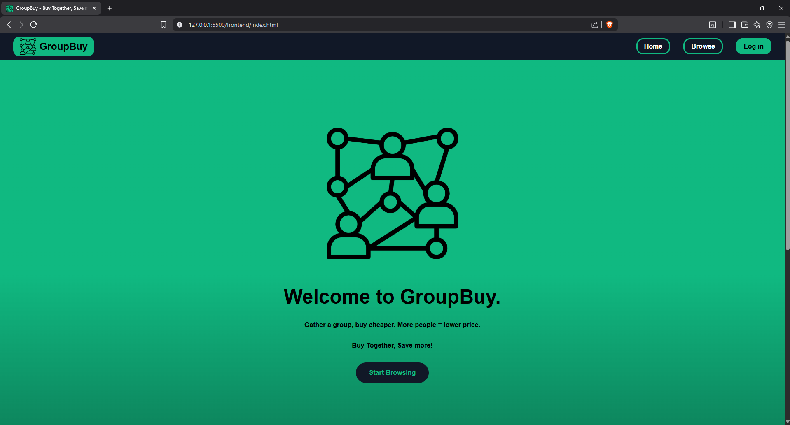
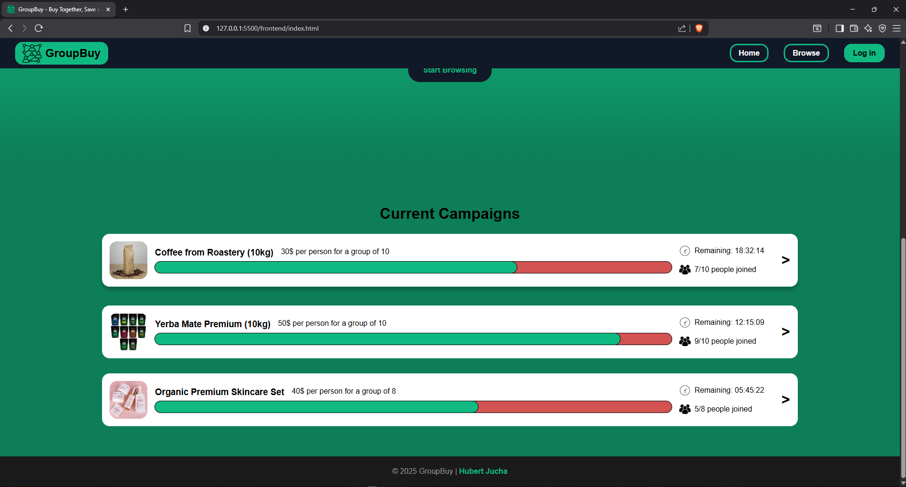
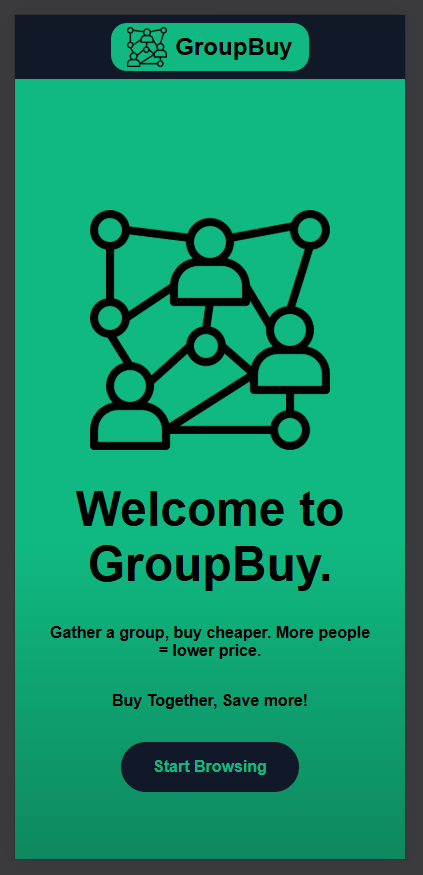
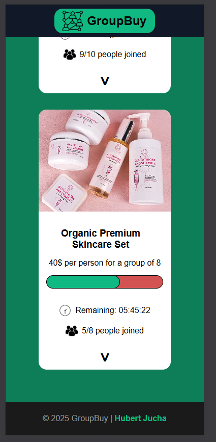

**Status:** ✅ ZAKOŃCZONY (15 listopada 2025, 01:11 UTC)

---

## 📅 TYDZIEŃ 2: JavaScript Basics (16-22 grudnia 2025)

### Cele: 
- Dodać interaktywność do landing page (filtry, search, sorting)
- Zaimplementować modal system z pledge functionality
- Fetch kampanii z JSON (async/await)
- Dodać localStorage (persist filtrów po odświeżeniu)
- Live countdown timers na kartach kampanii

### Zrobione:
- ✅ **Filtering system** (kategorie: Food, Beauty, Electronics, Sports, All)
  - Dropdown `<select>` z event listener (`change` event)
  - `filterCampaigns()` function używająca `.filter()` method
  - Match category ORAZ search query (combined filters)
  
- ✅ **Search functionality** (real-time search po tytule kampanii)
  - Input `<input type="search">` z event listener (`input` event)
  - Case-insensitive search (`.toLowerCase()` + `.includes()`)
  - Instant filtering podczas pisania
  
- ✅ **Sorting system** (4 opcje sortowania)
  - Price: Low to High / High to Low
  - People Joined: Most First
  - Deadline: Ending Soon
  - `.sort()` method z custom comparator functions
  
- ✅ **Combined filters** (kategoria + search + sort działają razem)
  - Refactoring do jednej `updateCampaigns()` function
  - Wszystkie filtry wywołują tę samą funkcję
  - Filtry nie resetują się nawzajem
  
- ✅ **Modal system** (szczegóły kampanii + join button)
  - Event delegation (listener na `.campaigns` container zamiast na każdej karcie)
  - `.closest()` method do znalezienia clicked card
  - Dynamic content creation (`.innerHTML` + template literals)
  - Modal overlay z click-outside-to-close
  
- ✅ **Join campaign functionality** (walidacja capacity)
  - Check `campaign.people.current >= campaign.people.capacity`
  - Error message display (`.hidden` class toggle)
  - Update `people.current` counter po dołączeniu
  - Re-render kampanii po update (aktualizacja progress bara)
  
- ✅ **LocalStorage persistence** (filtry zostają po F5)
  - `localStorage.setItem()` przy każdej zmianie filtra
  - `localStorage.getItem()` przy ładowaniu strony
  - Fallback na domyślne wartości (`|| "all"`, `|| ""`, `|| "default"`)
  - Object structure dla saved filters (DRY principle)
  
- ✅ **API call** (fetch from local JSON file)
  - `async/await` syntax zamiast `.then()` chains
  - `fetch("./campaigns.json")` + `response.json()`
  - Loading state (user-friendly message podczas fetch)
  - Error handling:  
    - `try/catch` (network errors, timeout)
    - `response.ok` check (HTTP 404/500 status codes)
    - `throw new Error()` dla HTTP errors (trafia do catch)
  - Success state (renderowanie kampanii po fetch)
  
- ✅ **Live countdown timers** (jeden timer na każdą kartę)
  - `setInterval()` (update co 1000ms = 1 sekunda)
  - `timetoSeconds()` / `secondsToTime()` conversion functions
  - Clear previous timers przy re-render (`clearInterval()` + array tracking)
  - Format: `HH:MM:SS` (leading zeros)
  
- ✅ **Smooth scroll navigation**
  - Browse buttons (hero + navbar) → campaigns section
  - `scrollIntoView({ behavior: 'smooth' })`
  - Better UX (no jumpy scrolling)

### Nauka (koncepty):

**JavaScript ES6+:**
- Arrow functions (`const fn = () => {}`)
- Template literals (`` `${variable}` ``)
- Destructuring (`const {name, age} = user`)
- Spread operator (nie użyte w projekcie)

**Async JavaScript:**
- Promises (obietnice przyszłej wartości)
- `async/await` syntax (czytelniejsze niż `.then()`)
- `try/catch` (obsługa błędów w async code)
- Fetch API (HTTP requests w przeglądarce)
- JSON parsing (`response.json()` też jest async!)

**DOM Manipulation:**
- `querySelector()` / `querySelectorAll()` (selektory CSS)
- `addEventListener()` (click, input, change events)
- `.innerHTML` (tworzenie HTML z JS)
- `.classList` (add/remove/toggle classes)
- Event delegation (listener na parent zamiast na każdym child)

**Array Methods:**
- `.filter()` (zwraca nową tablicę z elementami spełniającymi warunek)
- `.map()` (transformuje każdy element tablicy)
- `.sort()` (sortuje tablicę - uwaga: mutuje original!)
- `.find()` (zwraca pierwszy element spełniający warunek)
- `.join()` (łączy tablicę w string)

**Error Handling:**
- **Network errors** (brak internetu, timeout) → `catch` łapie automatycznie
- **HTTP errors** (404, 500) → `fetch()` NIE rzuca błędu, trzeba sprawdzić `response.ok`
- `throw new Error()` (ręczne rzucenie błędu → trafia do `catch`)
- User-friendly error messages (nie tylko `console.error()`)

**LocalStorage API:**
- `localStorage.setItem(key, value)` (zapisz - tylko stringi!)
- `localStorage.getItem(key)` (odczytaj - zwraca string lub null)
- `JSON.stringify()` / `JSON.parse()` (konwersja obiekt ↔ string)
- Persistence across page refreshes (dane zostają po zamknięciu przeglądarki)

**Timers:**
- `setInterval(fn, ms)` (wykonuj funkcję co X milisekund)
- `clearInterval(timerId)` (zatrzymaj timer)
- Timer cleanup (ważne przy re-render - bez tego memory leak!)

**Status:** ✅ ZAKOŃCZONY (22 grudnia 2025, 03:27 UTC)

### Notatki:
- Repo: https://github.com/pxyvrld/groupbuy-platform
- Następny projekt: mobile-first (`min-width` zamiast `max-width`)
- Hamburger menu na mobile (Week 3 - JavaScript)
- Następny krok: React setup (Vite) → przepisanie logiki do React components

---

## 📅 TYDZIEŃ 3: React Migration + UI Improvements (23 grudnia 2025 - 4 stycznia 2026)

### Cele:
- Migracja vanilla JavaScript → React
- Setup Vite + React project
- Komponenty (Header, Hero, Filters, CampaignCard, Footer)
- useState + useEffect hooks
- Props drilling + lifting state up
- Responsive hamburger menu
- "How It Works" sekcja
- CSS refactor (modular, CSS variables)

### Zrobione: 

**React Core:**
- ✅ **Vite setup** - `npm create vite@latest` (React template)
- ✅ **Component architecture** - 6 komponentów: 
  - `Header.jsx` - navbar z hamburger menu
  - `Hero.jsx` - hero section z Browse Campaigns button
  - `Filters.jsx` - search bar + 2x select (category, sort)
  - `CampaignCard.jsx` - pojedyncza karta kampanii
  - `Footer.jsx` - footer z linkami
  - `HowItWorks.jsx` - 3-step guide
- ✅ **useState hooks** (4x):
  - `searchTerm` - search bar input
  - `selectedCategory` - category filter
  - `selectedSort` - sort dropdown
  - `timeRemaining` - countdown timer (per card)
- ✅ **useEffect hook** - countdown timers
  - Jeden `useEffect` per karta (dependency: `timeRemaining`)
  - Cleanup function (`return () => clearInterval(timer)`)
  - Funkcjonalne update (`setTimeRemaining(prev => prev - 1)`)
- ✅ **Props drilling** - lifting state up: 
  - App.jsx → Filters (search/category/sort state)
  - Filters → App.jsx (setState callbacks)
  - App.jsx → CampaignCard (campaign data)
- ✅ **Controlled inputs** - `value` + `onChange` (search, selects)

**UI/UX Improvements:**
- ✅ **CSS refactor**:
  - Osobne pliki CSS per komponent (`components/styles/`)
  - CSS Variables (`:root` - colors, spacing)
  - Modular approach (component-scoped styles)
- ✅ **Responsive hamburger menu**:
  - 3 paski (`.hamburger` button)
  - Slide-in animation z prawej (`right: -100%` → `right: 0`)
  - Overlay (ciemne tło `rgba(0,0,0,0.6)`)
  - `useState` toggle (`isMenuOpen`)
  - Close on link click + overlay click
- ✅ **"How It Works" sekcja**:
  - 3 steps (Browse, Join, Save)
  - Grid layout (3 cols desktop, 1 col mobile)
  - Step numbers w kółkach (`border-radius: 50%`)
- ✅ **Card badges improvements**:
  - Category badge (lewy górny róg)
  - Time badge (prawy górny róg)
  - `min-width: fit-content` (auto-sizing, no fixed width)
  - `white-space: nowrap` (tekst w 1 linii, nie łamie się)
  - `box-shadow` (depth effect)
- ✅ **Grid layout**:
  - Desktop: `grid-template-columns: repeat(2, 1fr)` (2 kolumny)
  - Mobile: `grid-template-columns: 1fr` (1 kolumna)
  - Breakpoint: `768px`
- ✅ **Smooth scroll navigation**:
  - Browse Campaigns button → `.campaigns` section
  - How It Works button → `#how-it-works` section
  - `scrollIntoView({ behavior: 'smooth' })`
- ✅ **Hero height fix**:
  - Desktop: `height: calc(100vh - 4rem)` (100vh minus navbar)
  - Mobile: `min-height: calc(100vh - 4rem)` (dopasowuje się do contentu)
  - Rozwiązuje problem "latania" przy zmianie orientacji telefonu

**Code Quality:**
- ✅ Semantic HTML (`<header>`, `<nav>`, `<main>`, `<section>`, `<article>`)
- ✅ Accessibility (`aria-label`, `aria-live="polite"` dla timerów)
- ✅ Reusable components (DRY principle)
- ✅ Clean file structure (`src/components/`, `src/data/`)

### Nauka (koncepty):

**React Fundamentals:**
- **Components** - budowanie UI z małych, reużywalnych części
- **JSX** - JavaScript XML (HTML w JS z `{}` dla expressions)
- **Props** - przekazywanie danych parent → child (read-only)
- **State** - dane które się zmieniają (re-render jak zmiana)
- **Lifting state up** - state w parent, callback functions do child

**React Hooks:**
- **useState** - `const [state, setState] = useState(initialValue)`
  - Zwraca array: [current value, setter function]
  - Re-render component jak setState wywołane
- **useEffect** - side effects (timers, API calls, subscriptions)
  - `useEffect(() => { /* effect */ }, [dependencies])`
  - Dependency array: `[]` = run once, `[value]` = run when value changes
  - Cleanup function: `return () => { /* cleanup */ }` (unmount/before next effect)
- **Functional updates** - `setState(prev => prev + 1)` (bezpieczne z async)

**Event Handling:**
- `onClick`, `onChange`, `onInput` (camelCase w React!)
- Event handlers jako arrow functions: `onClick={() => fn()}`
- Passing callbacks jako props: `<Child onUpdate={handleUpdate} />`

**Conditional Rendering:**
- `{isOpen && 
...
}` (render only if true)
- `{isOpen ? <A /> : <B />}` (ternary operator)
- `className={`base ${isActive ? 'active' : ''}`}` (dynamic classes)

**Lists & Keys:**
- `.map()` do renderowania list: `{campaigns.map(c => <Card key={c.id} />)}`
- **key prop** - unikalne ID (pomaga React zoptymalizować re-renders)

**CSS in React:**
- `className` (nie `class`!)
- Inline styles: `style={{width: `${percent}%`}}` (object notation)
- CSS Modules (scoped styles, unikalne nazwy klas)
- CSS Variables (`:root` - globalne kolory/spacing)

**Project Structure:**
- `src/components/` - wszystkie komponenty
- `src/components/styles/` - CSS per komponent
- `src/data/` - mock data
- `public/assets/` - static files (images, icons)

### Screenshots: 
_(Week 3 używa tych samych screenów co Week 2 - UI wygląda tak samo, tylko pod spodem React zamiast vanilla JS)_

**Status:** ✅ ZAKOŃCZONY (4 stycznia 2026, ~19:00 UTC)

### Notatki:
- Repo: https://github.com/pxyvrld/groupbuy-platform
- PR: Week 3: React Migration + UI Improvements (week3 → main)
- Następny krok: Week 4 - React Router + TypeScript + Pages
- Czas: ~15-20h (split: ~10h React migration, ~5-10h UI improvements)

---

## 📅 TYDZIEŃ 4: TypeScript + React Router + Advanced Architecture (5 stycznia - 3 marca 2026)

### Cele:
- Pełna migracja na TypeScript
- Implementacja React Router (multi-page app)
- Podział na Pages vs Components
- 8 stron (Home, Campaigns, CampaignDetails, Dashboard, Create, Login, Signup, 404)
- Type-safe komponenty i props
- CSS improvements (page-specific styling)

### Zrobione:

**TypeScript Migration:**
- ✅ **Konwersja .jsx → .tsx** - wszystkie komponenty i strony
- ✅ **Type definitions** - plik `src/types/campaign.ts`:
  - Interface `Campaign` (id, title, description, image, category, pricing, people, organizer, deadline)
  - Interface `Category` (id, name, icon)
  - Interface `PricingTier` (people, pricePerPerson)
  - Interface `Pricing` (basePrice, tiers, currentPrice)
  - Interface `People` (current, capacity, minRequired)
  - Interface `Organizer` (name, avatar)
- ✅ **Typed props** - interface dla każdego komponentu:
  - `CampaignCardProps` (campaign: Campaign)
  - `FiltersProps` (searchTerm, setSearchTerm, selectedCategory, setSelectedCategory, selectedSort, setSelectedSort)
  - `HeroProps` (brak - statyczny komponent)
- ✅ **Typed hooks**:
  - `useState<string>` (searchTerm, selectedCategory, selectedSort)
  - `useEffect` z dependency array (cleanup dla timerów)
  - `useParams<{ id: string }>` (dynamic routing)
  - `useNavigate()` (programmatic navigation)
- ✅ **Event handlers**:
  - `React.ChangeEvent<HTMLInputElement | HTMLSelectElement | HTMLTextAreaElement>`
  - `React.SyntheticEvent` (submit formularzy)
- ✅ **Function parameters** - explicit types:
  - `filterCampaigns(searchTerm: string, selectedCategory: string)`
  - `formatTimeLeft(deadline: string): string`
  - `pad(num: number): string`
- ✅ **Array methods** - typed:
  - `.filter()`, `.map()`, `.sort()` z typowanymi callback functions
  - `.reduce<number>()` dla obliczeń (np. total saved)
- ✅ **Zero TS errors** - cały projekt kompiluje się bez błędów

**React Router v6:**
- ✅ **Setup** - `npm install react-router-dom`
- ✅ **BrowserRouter** - wrap całej aplikacji w `App.tsx`
- ✅ **Routes & Route** - 8 route'ów:
  - `/` → HomePage
  - `/campaigns` → CampaignsPage
  - `/campaign/:id` → CampaignDetailsPage (dynamic)
  - `/login` → LoginPage
  - `/signup` → SignUpPage
  - `/dashboard` → DashboardPage
  - `/create` → CreateCampaignPage
  - `*` → NotFoundPage (catch-all 404)
- ✅ **Navigation**:
  - `<Link to="/path">` (SPA navigation, no reload)
  - `useNavigate()` (redirect po login/signup)
  - `useParams()` (dynamic id z URL)
- ✅ **Persistent layout** - Header + Footer wrap all routes

**Page-Based Architecture:**
- ✅ **HomePage** (`src/pages/HomePage.tsx`):
  - Hero section
  - Featured campaigns (first 4 from data)
  - HowItWorks section
- ✅ **CampaignsPage** (`src/pages/CampaignsPage.tsx`):
  - Full campaign list
  - Filters (search, category, sort)
  - Grid layout (2 cols desktop, 1 col mobile)
- ✅ **CampaignDetailsPage** (`src/pages/CampaignDetailsPage.tsx`):
  - Dynamic routing (`/campaign/:id`)
  - Full campaign info (image, description, pricing tiers, organizer)
  - Join/Leave button (capacity validation)
  - Error handling (404 jeśli campaign nie istnieje)
- ✅ **DashboardPage** (`src/pages/DashboardPage.tsx`):
  - Mock user object (id, name, email, createdCampaigns, joinedCampaigns)
  - Tabs: "My Campaigns" / "Joined Campaigns"
  - Stats: Campaigns Created, Campaigns Joined, Total Saved (calculated)
  - Grid z CampaignCard dla odpowiednich kampanii
- ✅ **CreateCampaignPage** (`src/pages/CreateCampaignPage.tsx`):
  - Full form (11 pól):
    - Title, Description, Image URL, Category (select)
    - Base Price, Tier 1 (max people, price), Tier 2 (max people, price), Tier 3 (price)
    - Capacity, Min Required, Deadline (datetime-local)
  - Controlled inputs (useState object dla formData)
  - Submit handler (console.log na razie - backend integration later)
- ✅ **LoginPage** (`src/pages/LoginPage.tsx`):
  - Email + Password inputs
  - Submit → zapisuje email do localStorage (mock auth)
  - Redirect do `/dashboard` (useNavigate)
  - Link do SignUp
- ✅ **SignUpPage** (`src/pages/SignUpPage.tsx`):
  - Username, Email, Password, Confirm Password
  - Password match validation (local state error)
  - Submit → zapisuje email + username do localStorage
  - Redirect do `/dashboard`
  - Link do Login
- ✅ **NotFoundPage** (`src/pages/NotFoundPage.tsx`):
  - 404 error message
  - Link do homepage

**Component Separation:**
- ✅ **Components** (`src/components/`) - reusable UI:
  - `Header.tsx` - navbar z hamburger menu
  - `Hero.tsx` - hero section z Browse button
  - `Filters.tsx` - search + 2x select (category, sort)
  - `CampaignCard.tsx` - pojedyncza karta (używana w 3 miejscach)
  - `Footer.tsx` - footer z linkami
  - `HowItWorks.tsx` - 3-step guide
- ✅ **Pages** (`src/pages/`) - route-specific views:
  - HomePage, CampaignsPage, CampaignDetailsPage, DashboardPage, CreateCampaignPage, LoginPage, SignUpPage, NotFoundPage

**CSS Improvements:**
- ✅ **Page-specific CSS** - każda strona ma swój plik:
  - `HomePage.css`, `CampaignsPage.css`, `DashboardPage.css`, `CreateCampaignPage.css`, `LoginPage.css`, `SignUpPage.css`, `NotFoundPage.css`
- ✅ **Component CSS** - w `src/components/styles/`:
  - `Header.css`, `Hero.css`, `Filters.css`, `CampaignCard.css`, `Footer.css`, `HowItWorks.css`
- ✅ **Modular styling** - każdy plik odpowiada za swój kawałek UI
- ✅ **CSS Variables** - `:root` w `index.css` (colors, spacing)
- ✅ **Form styling** - consistent design dla inputs, textareas, buttons
- ✅ **Tab navigation** - active state styling (dashboard tabs)
- ✅ **Responsive** - mobile-first approach (breakpoint 768px)

**Data & State:**
- ✅ **campaigns.ts** - typed export (`Campaign[]`)
- ✅ **mockUser** - object w DashboardPage (id, name, email, createdCampaigns, joinedCampaigns)
- ✅ **localStorage** - mock auth (email + username)
- ✅ **State management** - useState dla:
  - Form inputs (CreateCampaignPage - 11 pól w jednym obiekcie)
  - Search/filter/sort (CampaignsPage)
  - Tab switching (DashboardPage)
  - Countdown timers (CampaignCard - per card useEffect)

**Code Quality:**
- ✅ **Zero implicit any** - wszystkie parametry typowane
- ✅ **Proper cleanup** - useEffect returns cleanup dla timerów
- ✅ **Null checks** - optional chaining dla `useParams()` (404 handling)
- ✅ **Error handling** - 404 page, campaign not found, password mismatch
- ✅ **Separation of concerns** - pages (logic + routing) vs components (UI)
- ✅ **DRY principle** - reusable CampaignCard, Filters, Header/Footer

### Nauka (koncepty):

**TypeScript Fundamentals:**
- **Type annotations** - `const name: string = "Jan"`
- **Interfaces** - custom types dla obiektów
- **Type inference** - TS sam wywnioskuje typ (nie zawsze trzeba pisać)
- **Union types** - `string | number` (może być jedno albo drugie)
- **Optional properties** - `name?: string` (może nie być)
- **Generic types** - `useState<string>`, `Array<Campaign>`
- **Type guards** - sprawdzanie typu przed użyciem (null checks)
- **Compile-time errors** - TS łapie błędy przed uruchomieniem

**React + TypeScript:**
- **Props interfaces** - `interface Props { name: string }`
- **Typed hooks** - `useState<T>`, `useEffect` (dependency array type-checked)
- **Event types** - `React.ChangeEvent`, `React.SyntheticEvent`, `React.MouseEvent`
- **Ref types** - `useRef<HTMLDivElement>(null)`
- **Children prop** - `React.ReactNode` (typ dla children)

**React Router:**
- **Client-side routing** - zmiana URL bez reload strony
- **BrowserRouter** - HTML5 History API (czyste URL bez `#`)
- **Routes & Route** - deklaracja route'ów w JSX
- **Link** - SPA navigation (preventDefault + pushState)
- **useNavigate** - programmatic navigation (redirect z JS)
- **useParams** - odczyt dynamic segments z URL (`/campaign/:id` → `{id: "2"}`)
- **Catch-all route** - `path="*"` (404 page)
- **Nested routes** - można zagnieżdżać Routes (nie użyte w projekcie)

**Forms in React:**
- **Controlled inputs** - `value` + `onChange` (state jako source of truth)
- **Form state** - object w useState (wszystkie pola w jednym obiekcie)
- **Submit handling** - `e.preventDefault()` (blokada default action)
- **Validation** - local state dla error messages
- **Input types** - text, email, password, number, datetime-local, select, textarea

**Advanced Patterns:**
- **Page vs Component separation** - pages handle routing/logic, components handle UI
- **Mock data** - hardcoded data przed backend integration
- **Mock auth** - localStorage jako temporary auth (przed JWT)
- **Calculated values** - derived state (np. totalSaved z reduce)
- **Conditional rendering** - tabs, error messages, 404 pages

### Screenshots:
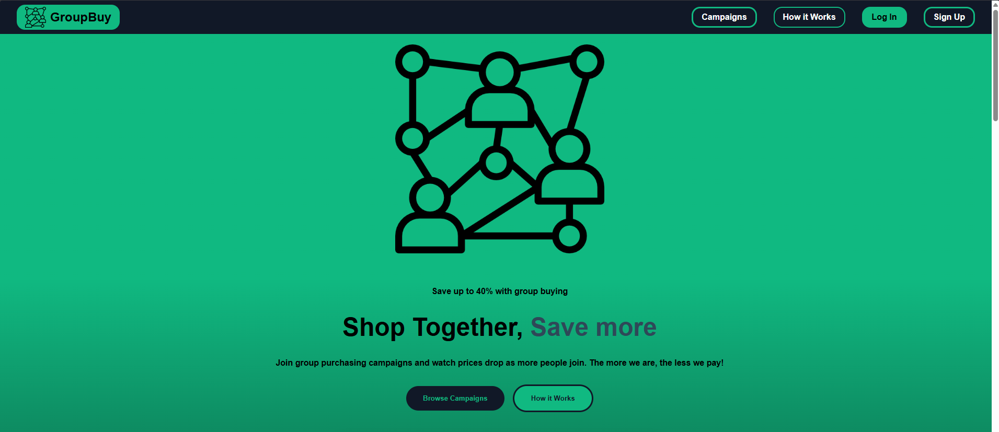
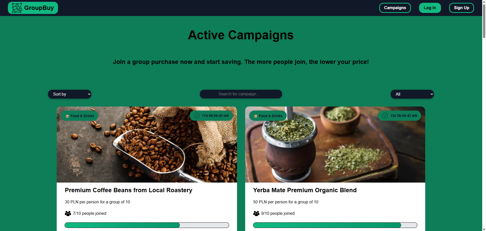
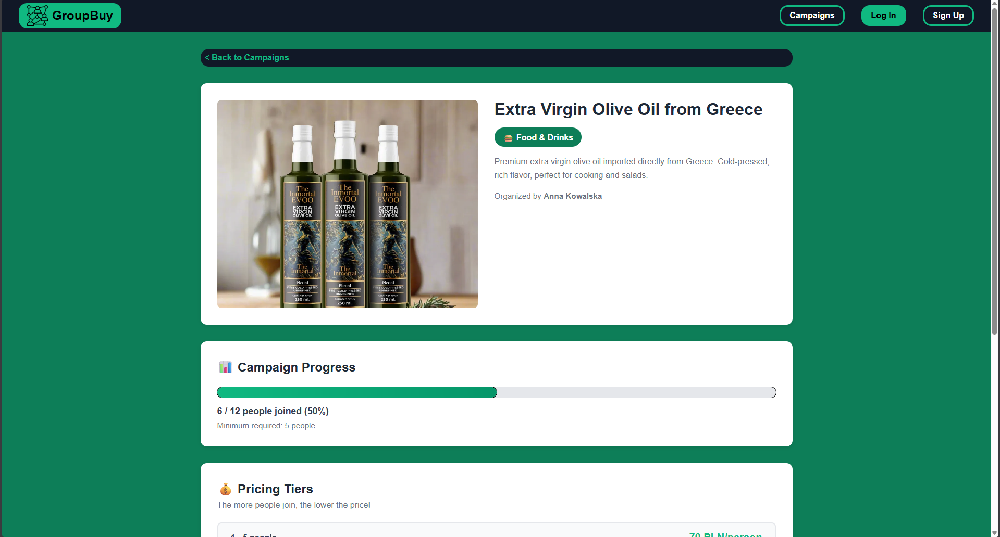
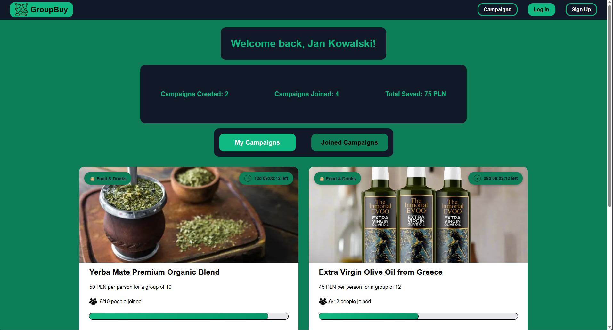
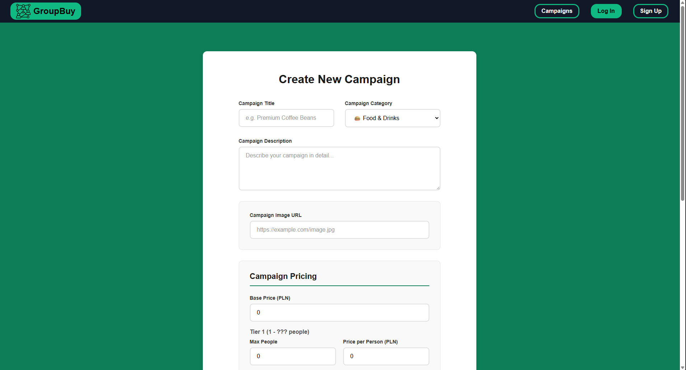
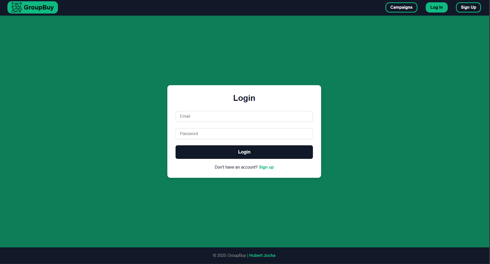
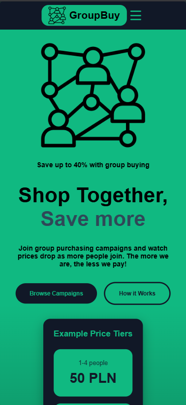
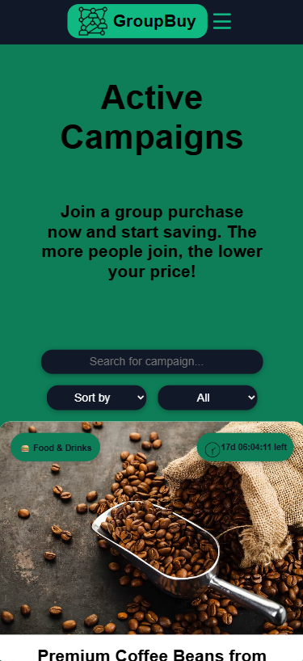
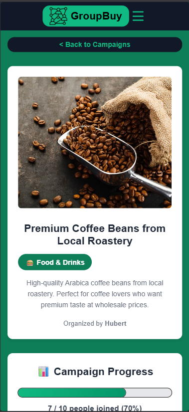

**Status:** ✅ ZAKOŃCZONY (3 marca 2026, ~18:00 UTC)

### Notatki:
- Repo: https://github.com/pxyvrld/groupbuy-platform
- PR: Week 4: TypeScript + React Router + Advanced Architecture (week4/advanced-react → main)
- Następny krok: Week 5-6 - Spring Boot Backend (REST API + JWT Auth + PostgreSQL + Docker)
- Czas: ~18-22h (split: ~8h TypeScript, ~6h React Router + Pages, ~4-8h CSS + polish)
- **Context API + Protected Routes** - przesunięte na po backendzie (żeby nie robić podwójnej roboty - najpierw mock, potem przepisywać pod prawdziwe API)

---

## 📅 WEEK 5-6: Backend + Integration (PLANNED)

### Cele:
- Spring Boot setup + PostgreSQL
- REST API dla campaigns (CRUD endpoints)
- JWT authentication (login, register, token validation)
- User-Campaign relationships (creator, joined)
- Frontend integration (Axios, AuthContext, Protected Routes)
- Docker (Dockerfile + docker-compose)

### TODO:
- 🔜 Spring Boot project setup (Spring Initializr)
- 🔜 Database schema (User, Campaign, PricingTier, Category tables)
- 🔜 JPA Entities + Repositories
- 🔜 Spring Security + JWT implementation
- 🔜 Campaign CRUD endpoints
- 🔜 User endpoints (profile, my campaigns, join/leave)
- 🔜 Frontend: Axios setup + interceptors (token in headers)
- 🔜 Frontend: AuthContext (login, logout, user state)
- 🔜 Frontend: Protected Routes (redirect if not logged in)
- 🔜 Docker: Dockerfile (backend + frontend)
- 🔜 Docker Compose (backend + frontend + PostgreSQL)

**Status:** 🚧 STARTING SOON

---

_Last updated: March 3, 2026_